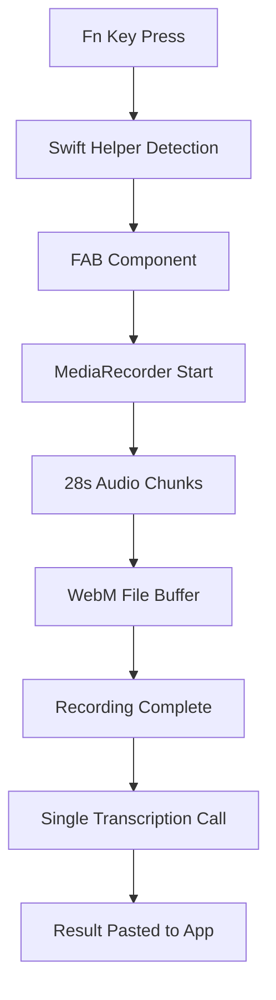
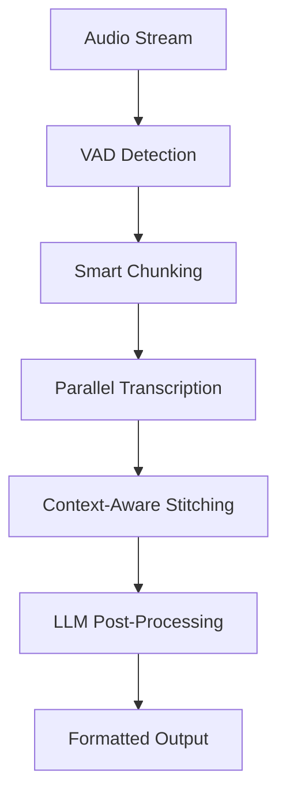

# Transcription Pipeline Documentation

## Overview

This document describes the transcription pipeline architecture for the Amical voice transcription application. The pipeline handles audio recording, processing, and AI-powered transcription with support for multiple transcription providers.

## Architecture Phases

### Phase 1: Complete Recording Transcription (Current Implementation)
- Record complete audio sessions 
- Process entire recording through Whisper
- Manual concatenation of results
- No real-time processing

### Phase 2: Chunked Real-Time Transcription (Future)
- Process audio in real-time chunks for low latency
- Stitch chunks together progressively  
- LLM post-processing for formatting and corrections

## Current Implementation (Phase 1)

### Audio Recording Flow



### Components

#### 1. Audio Capture (`src/modules/audio/audio-capture.ts`)

**Purpose**: Manages audio recording and file creation
**Key Features**:
- Receives audio chunks from renderer process via IPC
- Creates timestamped WebM files in `userData/recordings/`
- Handles stream management and file finalization
- Emits `recording-finished` event with file path

**Core Methods**:
```typescript
handleAudioChunk(chunk: Buffer, isFinalChunk: boolean): void
// - First chunk: Creates new WriteStream with timestamp
// - Subsequent chunks: Appends to existing stream  
// - Final chunk: Calls finalizeRecording()

finalizeRecording(): void
// - Closes WriteStream
// - Validates file size
// - Emits 'recording-finished' event
```

#### 2. Transcription Clients

**Base Interface** (`src/modules/ai/transcription-client.ts`):
```typescript
interface TranscriptionClient {
  transcribe(audioData: Buffer): Promise<string>;
}
```

**Available Implementations**:

##### OpenAI Whisper Client (`src/modules/ai/openai-whisper-client.ts`)
- Uses OpenAI's Whisper API (whisper-1 model)
- Converts Buffer to OpenAI File format
- Handles API errors and retries
- Requires OpenAI API key

##### Amical Cloud Client (`src/modules/ai/amical-cloud-client.ts`)  
- Uses Amical's cloud transcription service
- Groq Whisper Large V3 model backend
- JSON API with Buffer array serialization
- Built-in admin API key

##### Local Whisper Client (`src/modules/ai/local-whisper-client.ts`)
- Uses local whisper.cpp installation
- Model management through ModelManagerService
- Supports multiple model sizes (tiny → large-v1)
- Temporary file processing with cleanup

#### 3. AI Service Orchestrator (`src/modules/ai/ai-service.ts`)

**Purpose**: Provides unified interface for transcription
**Features**:
- Abstracts transcription client selection
- Handles client initialization
- Error handling and logging
- Future: Will coordinate multi-step processing

### Data Flow

#### 1. Recording Initiation
```typescript
// Swift Helper detects Fn key
flagsChanged event → FAB component → useRecording.startRecording()
```

#### 2. Audio Chunk Processing  
```typescript
// Renderer Process (useRecording.ts)
MediaRecorder.ondataavailable → onAudioChunk(arrayBuffer, isFinalEvent)

// Main Process (main.ts)  
'audio-data-chunk' IPC → audioCapture.handleAudioChunk(chunk, isFinal)
```

#### 3. File Creation
```typescript
// AudioCapture creates WebM file
const timestamp = new Date().toISOString().replace(/[:.]/g, '-');
const filePath = `userData/recordings/recording-${timestamp}.webm`;
```

#### 4. Transcription Processing
```typescript
// Main Process (main.ts lines 333-386)
audioCapture.on('recording-finished', async (filePath) => {
  const audioBuffer = await fsPromises.readFile(filePath);
  const transcription = await aiService.transcribeAudio(audioBuffer);
  
  // Paste result via Swift helper
  swiftIOBridgeClientInstance.call('pasteText', { transcript: transcription });
});
```

### Configuration

#### Transcription Provider Selection
```typescript
// main.ts line 60-75
const createTranscriptionClient = () => {
  const useCloudInference = true; // Configuration flag
  
  if (useCloudInference) {
    return new AmicalCloudClient();
  } else {
    const apiKey = store.get('openai-api-key') || process.env.OPENAI_API_KEY;
    return new OpenAIWhisperClient(apiKey);
  }
};
```

#### Audio Settings
- **Chunk Duration**: 28 seconds (configurable in useRecording.ts)
- **Audio Format**: WebM (MediaRecorder default)
- **Sample Rate**: System default
- **Channels**: Mono (typical for speech)

### System Integration

#### Swift Helper Integration
- **Fn Key Detection**: Monitors keyboard events for recording trigger
- **System Audio Muting**: Prevents audio feedback during recording  
- **Context Capture**: Gets active application for proper text insertion
- **Text Pasting**: Inserts transcription results into active applications

#### Storage
- **Audio Files**: `userData/recordings/recording-{timestamp}.webm`
- **API Keys**: Electron Store (`openai-api-key`)
- **Downloaded Models**: Electron Store (`downloaded-models`)
- **Database**: SQLite with transcription history (future enhancement)

## Limitations of Current Implementation

### No Real-Time Processing
- Complete recording must finish before transcription begins
- High latency for long recordings (30+ seconds)
- No progressive results or live feedback

### Single Pass Transcription
- No error correction or post-processing
- No context awareness between recording sessions
- No custom vocabulary application

### File-Based Processing
- Temporary files consume disk space
- I/O overhead for large recordings
- No streaming transcription support

## Future Enhancements (Phase 2)

### Real-Time Chunked Transcription

#### Proposed Architecture


#### Key Components to Add

**1. Smart Audio Chunking**
- Voice Activity Detection (VAD) boundary detection
- Configurable chunk sizes (2-10 seconds)
- Overlap handling for word boundary preservation
- Silence detection for natural break points

**2. Streaming Transcription**
```typescript
interface StreamingTranscriptionClient {
  transcribeChunk(chunk: Buffer, chunkId: number): Promise<ChunkResult>;
  finalizeSession(sessionId: string): Promise<string>;
}

interface ChunkResult {
  chunkId: number;
  text: string;
  confidence: number;
  isPartial: boolean;
  wordTimestamps?: WordTimestamp[];
}
```

**3. Context-Aware Stitching**
- Maintains conversation context across chunks
- Handles overlapping speech and corrections
- Preserves speaker transitions and punctuation
- Confidence-based chunk merging

**4. LLM Post-Processing Pipeline**
```typescript
interface LLMProcessor {
  formatText(rawTranscription: string): Promise<string>;
  correctErrors(text: string, context?: string): Promise<string>;
  applyCustomVocabulary(text: string, vocabulary: string[]): Promise<string>;
}
```

#### Benefits of Phase 2
- **Low Latency**: Results appear within 2-3 seconds
- **Progressive Display**: Users see transcription as they speak
- **Higher Accuracy**: Context-aware processing and error correction
- **Better UX**: Live feedback and partial results

### Implementation Considerations

#### Challenges
- **WebRTC Streaming**: Need to replace file-based processing
- **State Management**: Track multiple concurrent chunks
- **Error Handling**: Graceful degradation for failed chunks
- **Performance**: Balance accuracy vs. speed
- **Memory Management**: Avoid accumulating chunk data

#### Technical Requirements
- WebSocket or streaming API support for transcription providers
- Chunk correlation and ordering system
- Configurable processing parameters (chunk size, overlap, etc.)
- Enhanced error recovery and retry logic

## Testing Strategy

### Current Testing Needs
- Audio capture reliability across different input devices
- Transcription accuracy across different audio qualities  
- Error handling for network failures and API limits
- File cleanup and storage management

### Future Testing Requirements
- Real-time performance benchmarking
- Chunk boundary accuracy testing
- Context preservation validation
- Memory leak detection under continuous use

## Monitoring and Observability

### Current Logging
- **Audio Capture**: File creation, chunk processing, errors
- **Transcription**: Provider selection, API calls, response times
- **System Integration**: Key events, paste operations, Swift calls

### Metrics to Add
- **Latency Metrics**: Recording → transcription → paste timing
- **Accuracy Metrics**: User corrections and feedback
- **Usage Patterns**: Recording duration, frequency, success rates
- **Performance Metrics**: Memory usage, CPU utilization, file I/O

---

*This documentation will be updated as Phase 2 development progresses and real-time chunked transcription is implemented.*